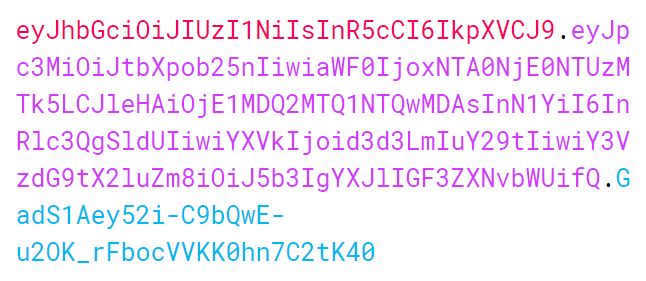

# JSON Web Token

本文内容主要来自于对 [jwt.io](https://jwt.io/introduction/) 的解读。

<p align="center">
  
</p>

## JWT 是什么？

JSON Web Token （JWT）是一个精简的开放标准（[RFC 7519](https://tools.ietf.org/html/rfc7519))，用来在不同实体之间传递安全可靠的信息。

JWT 定义了一种基于 JSON 对象的、紧凑的、自包含的、安全的数据传递方式。

* 紧凑性：JWT 的**体积很小**，它可以通过 URL、POST 参数和 HTTP 头部传输
* 自包含：JWT 本身带有用户相关信息，避免了从数据库查询
* 安全性：JWT 是通过 HMAC 或者 RSA 签名的、可以保证数据完整性

## 应用场景

1. 身份认证
  
  身份认证是 JWT 最常见的应用场景。当用户首次登陆成功后，后续的请求只要带上 JWT 即可完成用户的认证。因为 JWT 的紧凑型和不存在跨域问题，它常常被用于单点登陆功能的实现。

2. 信息交换

  由于 JWT 具有安全性，它可用于在不同实体之间进行数据传递。这种方式既能确保数据的发送者的身份，也能确保数据未被篡改过。

## 如何生成

JWT 由三部分内容组成，包括：

* 头部
* 载荷
* 签名

使用 `.` 把以上内容连接起来就拼成了完整的 JWT 令牌，形如 `x.y.z` 。

### 头部

头部一般包含两个字段，即令牌类型和签名算法。令牌类型始终是 `JWT` ；签名算法可以是 HMAC SHA256 或者 RSA 。

> [HMAC](https://www.ietf.org/rfc/rfc2104.txt)：Hash-based Message Authentication Code，密钥相关的哈希运算消息认证码。
> HMAC 标准定义了 HMAC 的生成方式：使用哈希算法（通常是 MD5、SHA-1）对消息和密钥进行签名得到 HMAC

例如，使用 HMAC SHA256 签名算法的头部为：

```json
{
  "alg": "HS256",
  "typ": "JWT"
}
```

然后使用 **Base64Url** 对头部进行编码就得到了 JWT 的第一部分 `x = eyJhbGciOiJIUzI1NiIsInR5cCI6IkpXVCJ9`。

### 载荷

载荷也是一个 JSON 对象，存放着用户相关的数据。它可以存放任何数据，但是标准有一些推荐的数据。以下面的载荷为例：

```json
{
  "iss": "mmzhong",
  "iat": 1504614553199,
  "exp": 1504614554000,
  "sub": "test JWT",
  "aud": "www.b.com",
  "custom_info": "yor are awesome"
}
```

前面五个字段是 JWT 标准所推荐的：

* `iss`: 签发者
* `iat`: 签发时间
* `exp`: 过期时间
* `sub`: 内容主题
* `aud`: 接收方

标准推荐的字段还有：

* `nbf`: 开始生效时间
* `jti`: JWT 唯一身份标识，主要用来作为一次性令牌，避免重放攻击

这些推荐字段是**可有可无的**，我们也可以添加任意数量的额外字段，如 `custom_info` 。

对载荷进行 **Base64Url** 编码后得到了 JWT 的第二部分 `y = eyJpc3MiOiJtbXpob25nIiwiaWF0IjoxNTA0NjE0NTUzMTk5LCJleHAiOjE1MDQ2MTQ1NTQwMDAsInN1YiI6InRlc3QgSldUIiwiYXVkIjoid3d3LmIuY29tIiwiY3VzdG9tX2luZm8iOiJ5b3IgYXJlIGF3ZXNvbWUifQ` 。

### 签名

头部和载荷都已经准备后了，最后一步就是使用签名算法对头部和载荷进行签名。签名用来保证签发者身份和数据的完整性。

以 HMAC SHA256 签名算法为例，签名的计算方式为：

```JavaScript
const signature = HMACSHA256(
  base64UrlEncode(header) + "." + base64UrlEncode(payload)
  'secret'
);
```

这样就得到了 JWT 的第三部分 `z = GadS1Aey52i-C9bQwE-u2OK_rFbocVVKK0hn7C2tK40` 。

所以，最终生成的 JWT 为：

<p align="center">
  
</p>

## 工作原理

<p align="center">
  
</p>

1. 用户在客户端输入账号和密码并提交
2. 账户验证通过后，服务端使用私钥生成 JWT
3. 把 JWT 返回给客户端，由客户端保存起来
4. 客户端再次发起请求时，把 JWT 添加到 `Authorization` 头部发给服务端
5. 服务端使用私钥验证 JWT 签名，校验通过则表示用户已认证，可以正确响应客户端请求，否则拒绝

## 使用优势

* 不需要在服务端保存会话信息，对分布式应用具备天生的亲和性
* 目前很多语言都支持 JSON ，使得 JWT 可以进行跨语言应用

## 注意事项

* 使用 HTTPS ，防止被拦截
* 避免在载荷中存放敏感信息，因为它仅仅是经过了 Base64 编码，是可以简单的还原为原文的。
* 慎重考虑 JWT 的存放位置，如 localStorage、Cookie 等，避免 XSS、CSRF 攻击，如果存放在 Cookie 中，一定要设置为 `HttpOnly`